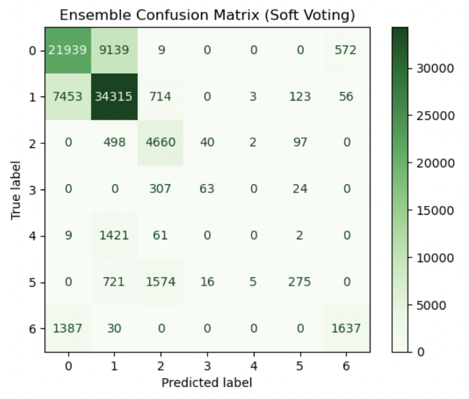

# Forest_Cover_Classification_Project

# deep-learning-cover-classification-project

Using TensorFlow and deep learning, this project classifies forest cover types using terrain and environmental features. We use Keras Tuner for hyperparameter optimization and ensemble learning for performance enhancement.

---

## 1. Project Overview

- This project aims to predict forest cover types (7 classes) based on cartographic features.
- Using the UCI Covertype dataset, we trained a deep learning model (CNN + Bi-LSTM) and improved performance through hyperparameter tuning and ensemble methods.
- Keras Tuner was used to find the best combination of optimizer, learning rate, and dropout rate.
- Final models were evaluated using classification metrics, confusion matrices, training curves, and error analysis.

---

## 2. Project Structure

The repository is organized as follows:

```
deep-learning-cover-classification-project/
├── cover_data.csv                            # Dataset file
├── CoverType-classification-origin.ipynb     # Baseline notebook (v1)
├── CoverType-classification-ImprovedPerformance.ipynb  # Tuned & Ensemble notebook (v2)
├── cover_classifier_model.h5                 # Final saved Keras model
├── my_tuner_dir/                             # Keras Tuner trial logs
└── README.md                                 # Project documentation
```

---

## 3. Dataset

- **Source**: UCI Machine Learning Repository – Forest CoverType Dataset
- **Target**: Multiclass classification (7 forest cover types)

**Features** (subset):
- Elevation
- Aspect
- Slope
- Horizontal/Vertical distance to hydrology
- Hillshade (morning, noon, 3pm)
- Distance to roadways
- Soil types (one-hot encoded)

---

## 4. Model Architecture

- **Embedding Layer**: Input projection
- **1D Convolution + Batch Normalization**
- **Bidirectional LSTM Layers**: LSTM(128) + LSTM(64)
- **Fully Connected**: Dense(64) → Dropout → Dense(7, softmax)

---

## 5. Hyperparameter Tuning

- Used **Keras Tuner (RandomSearch)**
- **Search Space**:
  - Optimizer: `adam`, `sgd`
  - Learning Rate: `1e-4 ~ 1e-2`
  - Dropout Rate: `0.2`, `0.4`
- **Best Parameters**:
  ```
  optimizer: sgd
  learning_rate: 0.001615
  dropout_rate: 0.2
  ```
- EarlyStopping applied (patience=3)
- GPU dynamic memory allocation activated with `tf.config.experimental.set_memory_growth`
- Best model saved to `cover_classifier_model.h5`

---

## 6. Model Evaluation

### 📌 Baseline Model (v1)
- Optimizer: `adam`, Learning rate: 0.0003, Dropout: 0.5
- Validation Accuracy: 68.5%
- Test Accuracy: 68.29%
- Macro F1-score: 0.47

### 📌 Tuned + Ensemble Model (v2)
- Optimizer: `sgd`, Learning rate: 0.001615, Dropout: 0.2
- Validation Accuracy: 71.99%
- Test Accuracy: 72.00%
- Macro F1-score: 0.46
- Weighted F1-score: 0.71

---

## 7. Confusion Matrix (Soft Voting)

> 

```
Highlights:
- Class 2 (Spruce/Fir): 88% recall
- Class 1 (Lodgepole Pine): 80% recall
- Class 4/5: Low recall, needs future work
```

---

## 8. Error Analysis

To analyze model weaknesses, we extracted and printed random misclassified examples.

```python
# 예측값이 정답과 다른 인덱스를 뽑아 무작위로 추출
incorrect_indices = np.where(y_pred_best != y_test)[0]
sample_indices = np.random.choice(incorrect_indices, size=5, replace=False)
print("\n잘못 분류된 샘플 예시:")
for idx in sample_indices:
    print(f"Index: {idx}, True Label: {y_test.iloc[idx]}, Predicted: {y_pred_best[idx]}")
```

📌 출력 예시:
```
Index: 40500, True Label: 6, Predicted: 0
Index: 14617, True Label: 1, Predicted: 0
Index: 58282, True Label: 0, Predicted: 1
Index: 11860, True Label: 0, Predicted: 1
Index: 73515, True Label: 1, Predicted: 0
```

This helps identify which classes are most frequently confused and motivates further class-specific tuning.

---

## 9. Performance Visualization

- **Per-Class Accuracy (Bar Chart)**:
  - Class 2 shows ~90% accuracy
  - Classes 4, 5, 6 show significantly lower accuracy

> 

- **Training Curve** (Train vs Validation Accuracy over Epochs):
  - Tuned model shows stable validation accuracy around 72%
  - Training accuracy slightly lower than validation (suggests potential underfitting or regularization)

> 

---

## 10. Comparison Summary

| Category             | Baseline Model (v1) | Tuned + Ensemble Model (v2) |
|----------------------|----------------------|-------------------------------|
| Optimizer            | adam                 | **sgd**                      |
| Learning Rate        | 0.0003               | **0.001615**                 |
| Dropout              | 0.5                  | **0.2**                      |
| Validation Accuracy  | 68.5%                | **71.99%**                   |
| Test Accuracy        | 68.29%               | **72.00%**                   |
| Macro F1-score       | 0.47                 | **0.46**                     |
| Ensemble Used        | No                   | **Yes (Soft Voting)**        |

---

## 11. Future Improvements

- Address class imbalance (oversampling or loss weighting)
- Introduce TabTransformer or attention-based models
- Apply confidence thresholding in ensemble inference
- Fine-tune batch size and learning schedule

---

## 12. References

- [Keras Tuner Documentation](https://keras.io/keras_tuner/)
- [UCI Covertype Dataset](https://archive.ics.uci.edu/ml/datasets/covertype)

> This project is part of a deep learning portfolio and focuses on model design, tuning, and evaluation.
